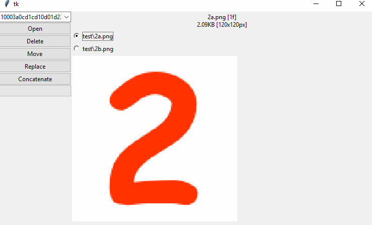

# deduplicator

Requires https://github.com/GiovanH/pysnip

## dedupc.py

Command-line dupedb manipulation

```
usage: dedupc.py [-h] [-f SCANFILES [SCANFILES ...]]
                 [--files-exempt FILES_EXEMPT [FILES_EXEMPT ...]] -s SHELVE
                 [--hashsize HASHSIZE] [--recheck] [-m] [-i]
                 [-a AVOID [AVOID ...]] [-p PRIORITIZE [PRIORITIZE ...]]
                 [--clobber] [-l] [-r] [--renameFromPaths] [-d] [--debug]
                 [--verbose] [--noprogress] [--purge] [--prune]

optional arguments:
  -h, --help            show this help message and exit
  -f SCANFILES [SCANFILES ...], --scanfiles SCANFILES [SCANFILES ...]
                        File globs that select which files to check. Globstar
                        supported.
  --files-exempt FILES_EXEMPT [FILES_EXEMPT ...]
                        File substrings to ignore
  -s SHELVE, --shelve SHELVE
                        Database name
  --hashsize HASHSIZE   How similar the images need to be to match. Default
                        12. Minimum 2. (2x2 image)
  --recheck             Re-fingerprint all files, even if they might not have
                        changed.
  -m, --mock            Don't actually delete or rename files, just print a
                        log of which ones would be deleted.
  -i, --interactive     Prompt for user selection in choosing the file to keep
                        instead of relying on the sort algorithm.
  -a AVOID [AVOID ...], --avoid AVOID [AVOID ...]
                        Substrings in the path to penalize during file
                        sorting.
  -p PRIORITIZE [PRIORITIZE ...], --prioritize PRIORITIZE [PRIORITIZE ...]
                        Substrings in the path to prioritize during file
                        sorting.
  --clobber             Allow overwriting files during rename.
  -l, --list            Show duplicate information on screen.
  -r, --renameDb        Rename files to their perceptual hash, ordering them
                        by similarity. Renames all images in DB.
  --renameFromPaths     Rename files to their perceptual hash, ordering them
                        by similarity. Only use images passed directly, not
                        the database.
  -d, --delete          Delete duplicate files by moving them to a temporary
                        directory.
  --debug               Print debugging information for hashes.
  --verbose             Print additional information.
  --noprogress          Disallow progress bars.
  --purge               Delete records of files not currently seen, even if
                        they're in the database.
  --prune               Remove stale records from database in advance.
```

## compare.py

Gui-based image comparison



```
usage: compare.py [-h] [-l] [--debug] [--verbose] shelvefile

positional arguments:
  shelvefile  Database name

optional arguments:
  -h, --help  show this help message and exit
  -l, --list  Show duplicate information on screen.
  --debug     Print debugging information for hashes.
  --verbose   Print additional information.
```

